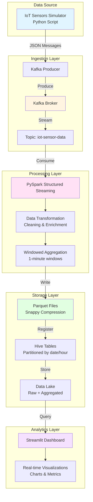

# Real-Time Streaming Data Pipeline and Analytics Dashboard


A complete end-to-end real-time data engineering project demonstrating streaming data ingestion, processing, storage, and visualization using modern Big Data technologies.

## 🎯 Project Goal

Build a production-ready real-time data pipeline that:
- Ingests streaming IoT sensor data
- Processes data using PySpark Structured Streaming
- Stores processed data in a partitioned data lake (Parquet format)
- Provides real-time analytics through an interactive dashboard
- Demonstrates best practices for data engineering and ETL pipelines

## 📊 Architecture



## 🛠️ Tech Stack

| Component | Technology | Purpose |
|-----------|-----------|---------|
| **Data Generation** | Python | IoT sensor data simulation |
| **Message Broker** | Apache Kafka | Real-time data ingestion |
| **Stream Processing** | PySpark Structured Streaming | ETL and transformations |
| **Storage Format** | Parquet with Snappy | Columnar storage |
| **Metadata Store** | Apache Hive | Table schemas and partitions |
| **Data Lake** | Local FS / AWS S3 | Persistent storage |
| **Visualization** | Streamlit | Real-time dashboard |
| **Containerization** | Docker & Docker Compose | Infrastructure setup |
| **Language** | Python 3.8+ | Primary development language |

## 📂 Project Structure

```
real_time_data_pipeline/
├── data_producer/              # Kafka producer for IoT data simulation
│   ├── kafka_producer.py       # Main producer script
│   └── requirements.txt        # Producer dependencies
├── spark_streaming/            # PySpark streaming ETL job
│   ├── streaming_etl.py        # Structured streaming application
│   └── requirements.txt        # Spark dependencies
├── hive_tables/                # Hive table schemas
│   └── schema.hql              # Table definitions and queries
├── dashboard/                  # Streamlit analytics dashboard
│   ├── app.py                  # Dashboard application
│   └── requirements.txt        # Dashboard dependencies
├── config/                     # Configuration files
│   └── kafka_config.yaml       # Kafka and Spark configurations
├── docker/                     # Docker infrastructure
│   └── docker-compose.yml      # Multi-container setup
├── docs/                       # Additional documentation
│   ├── ARCHITECTURE.md         # Detailed architecture guide
│   └── AWS_DEPLOYMENT.md       # AWS cloud deployment guide
├── setup.sh                    # Setup script
├── run.sh                      # Run all components script
├── .gitignore                  # Git ignore rules
├── LICENSE                     # MIT License
└── README.md                   # This file
```

## 🚀 Quick Start

### Prerequisites

- Python 3.8 or higher
- Docker and Docker Compose
- 4GB+ RAM available
- 10GB+ disk space

### Installation

1. **Clone the repository**
   ```bash
   git clone https://github.com/yadavanujkumar/Real-Time-Streaming-Data-Pipeline-and-Analytics-Dashboard.git
   cd Real-Time-Streaming-Data-Pipeline-and-Analytics-Dashboard
   ```

2. **Run the setup script**
   ```bash
   chmod +x setup.sh
   ./setup.sh
   ```
   This will:
   - Create a Python virtual environment
   - Install all dependencies
   - Start Docker containers (Kafka, Zookeeper, Hive)
   - Create Kafka topics

3. **Activate virtual environment**
   ```bash
   source venv/bin/activate
   ```

### Running the Pipeline

#### Option 1: Automated Start (Recommended)

```bash
./run.sh
```

This script starts all components automatically:
- Kafka and supporting services
- Data producer
- Spark streaming job
- Streamlit dashboard

#### Option 2: Manual Start (Step-by-step)

1. **Start Infrastructure**
   ```bash
   cd docker
   docker-compose up -d
   cd ..
   ```

2. **Start Kafka Producer**
   ```bash
   python data_producer/kafka_producer.py \
       --bootstrap-servers localhost:9092 \
       --topic iot-sensor-data \
       --interval 1
   ```

3. **Start Spark Streaming Job**
   ```bash
   python spark_streaming/streaming_etl.py \
       --kafka-bootstrap-servers localhost:9092 \
       --kafka-topic iot-sensor-data \
       --checkpoint-location ./checkpoint \
       --output-path ./output \
       --mode all
   ```

4. **Launch Dashboard**
   ```bash
   export DATA_PATH=./output
   streamlit run dashboard/app.py
   ```

### Access the Services

- **Streamlit Dashboard**: http://localhost:8501
- **Kafka UI**: http://localhost:8080
- **Spark Master UI**: http://localhost:8081

## 📋 Detailed Component Guide

### 1. Data Producer

**Purpose**: Simulates real-time IoT sensor data

**Features**:
- Generates temperature, humidity, pressure readings
- Multiple sensors across different locations
- Configurable message rate
- JSON message format

**Usage**:
```bash
python data_producer/kafka_producer.py \
    --bootstrap-servers localhost:9092 \
    --topic iot-sensor-data \
    --interval 1 \
    --count 100
```

**Sample Output**:
```json
{
    "sensor_id": "SENSOR_001",
    "location": "Building_A",
    "timestamp": "2024-01-01T10:00:00",
    "temperature": 23.5,
    "humidity": 65.2,
    "pressure": 1013.25,
    "battery_level": 85.0,
    "status": "ACTIVE"
}
```

### 2. Spark Streaming ETL

**Purpose**: Process streaming data with transformations and aggregations

**Features**:
- Kafka integration with Structured Streaming
- Data quality checks and cleaning
- Windowed aggregations (1-minute tumbling windows)
- Partitioned Parquet output
- Checkpointing for fault tolerance

**Key Transformations**:
- Parse JSON from Kafka
- Add processing timestamp
- Filter invalid readings
- Calculate aggregate statistics

**Aggregations**:
- Average, Min, Max temperature per sensor
- Average humidity and pressure
- Reading counts per window

**Usage**:
```bash
python spark_streaming/streaming_etl.py \
    --kafka-bootstrap-servers localhost:9092 \
    --kafka-topic iot-sensor-data \
    --checkpoint-location /path/to/checkpoint \
    --output-path /path/to/output \
    --mode all  # Options: raw, aggregated, all, console
```

### 3. Data Storage

**Format**: Apache Parquet with Snappy compression

**Partitioning Strategy**:
```
output/
├── raw_data/
│   └── date=2024-01-01/
│       └── hour=10/
│           └── *.parquet
└── aggregated_data/
    └── date=2024-01-01/
        └── hour=10/
            └── *.parquet
```

**Benefits**:
- 70% compression ratio
- Efficient columnar queries
- Schema evolution support
- Predicate pushdown

### 4. Hive Tables

**Purpose**: Provide SQL interface to Parquet data

**Tables**:
- `iot_sensor_raw`: Raw sensor readings
- `iot_sensor_aggregated`: Aggregated metrics

**Sample Query**:
```sql
SELECT 
    sensor_id,
    AVG(avg_temperature) as daily_avg_temp,
    COUNT(*) as reading_count
FROM iot_sensor_aggregated
WHERE date = '2024-01-01'
GROUP BY sensor_id
ORDER BY daily_avg_temp DESC;
```

### 5. Analytics Dashboard

**Purpose**: Real-time visualization of sensor data

**Features**:
- Live metrics (active sensors, averages, etc.)
- Temperature timeline by sensor
- Sensor performance comparison
- Location-based analytics
- Aggregated trends over time
- Auto-refresh capability
- Interactive data tables

**Key Visualizations**:
1. KPI Metrics Cards
2. Temperature Timeline Charts
3. Sensor Comparison Bar Charts
4. Location Heatmaps
5. Aggregated Metrics Plots

## 🎓 Technical Deep Dive

### Data Flow

1. **Ingestion**: Producer simulates sensors → Kafka topic
2. **Streaming**: Spark reads from Kafka with micro-batches
3. **Processing**: Transform, clean, aggregate in memory
4. **Storage**: Write to partitioned Parquet files
5. **Metadata**: Register tables in Hive metastore
6. **Analytics**: Dashboard queries Parquet files

### Performance Optimizations

#### Spark Configurations
```yaml
spark.sql.adaptive.enabled: true
spark.sql.adaptive.coalescePartitions.enabled: true
spark.streaming.stopGracefullyOnShutdown: true
spark.sql.parquet.compression.codec: snappy
spark.sql.shuffle.partitions: 4
```

#### Kafka Configurations
```yaml
acks: all
compression.type: snappy
max.in.flight.requests.per.connection: 1
```

#### Processing Optimizations
- Micro-batch interval: 30 seconds
- Watermark: 10 minutes for late data
- Partitioned writes for parallel I/O
- Checkpointing every micro-batch

### Fault Tolerance

1. **Kafka**: Message replication, broker failover
2. **Spark**: Checkpointing, task retry, graceful shutdown
3. **Storage**: Atomic writes, versioning (S3)

### Scalability

**Horizontal Scaling**:
- Add Kafka partitions for higher throughput
- Add Spark executors for parallel processing
- Distribute across multiple nodes

**Vertical Scaling**:
- Increase executor memory/cores
- Larger Kafka broker instances
- Faster storage (SSD, S3)

**Capacity Planning**:
- 1 message/sec × 5 sensors = 432K messages/day
- ~50 bytes/message = 21.6 MB/day raw
- With compression: ~6-7 MB/day

## ☁️ AWS Cloud Deployment

For production deployment on AWS, see [AWS Deployment Guide](docs/AWS_DEPLOYMENT.md).

**Key AWS Services**:
- **Amazon MSK**: Managed Kafka service
- **Amazon EMR**: Managed Spark clusters
- **Amazon S3**: Scalable data lake
- **AWS Glue**: Managed Hive metastore
- **Amazon EC2/ECS**: Producer and dashboard hosting

**Estimated Monthly Cost**: ~$1,860 (can be optimized with Spot instances)

## 📈 Monitoring & Observability

### Metrics to Track

**Kafka**:
- Message throughput (messages/sec)
- Consumer lag
- Broker CPU and disk usage

**Spark**:
- Micro-batch duration
- Processing rate (records/sec)
- Task failures and retries
- Memory usage

**Storage**:
- Data volume growth
- Query performance
- Partition count

### Monitoring Tools

- Kafka UI: http://localhost:8080
- Spark UI: http://localhost:4040 (when streaming job is running)
- Docker stats: `docker stats`

## 🧪 Testing

### Unit Tests (Future Enhancement)
```bash
pytest tests/
```

### Integration Tests
```bash
# Test producer
python data_producer/kafka_producer.py --count 10

# Test streaming (console mode)
python spark_streaming/streaming_etl.py --mode console

# Test dashboard
streamlit run dashboard/app.py
```

## 🔒 Security Considerations

**Local Development**:
- No authentication (for simplicity)
- Docker network isolation

**Production (AWS)**:
- IAM roles for service access
- VPC for network isolation
- Encryption at rest (S3, MSK)
- Encryption in transit (TLS/SSL)
- Security groups and NACLs
- CloudTrail for audit logging

## 🐛 Troubleshooting

### Common Issues

**Issue**: Kafka connection refused
```bash
# Solution: Ensure Kafka is running
docker-compose -f docker/docker-compose.yml ps
docker-compose -f docker/docker-compose.yml up -d kafka
```

**Issue**: Spark job fails with memory error
```bash
# Solution: Increase executor memory
spark-submit --executor-memory 4g streaming_etl.py
```

**Issue**: Dashboard shows no data
```bash
# Solution: Check if data files exist
ls -lah output/raw_data/
ls -lah output/aggregated_data/

# Ensure streaming job is running
ps aux | grep streaming_etl
```

**Issue**: Docker containers keep restarting
```bash
# Solution: Check logs
docker logs kafka
docker logs zookeeper

# Allocate more resources in Docker Desktop
```

## 🤝 Contributing

Contributions are welcome! Please feel free to submit a Pull Request.

## 📄 License

This project is licensed under the MIT License - see the [LICENSE](LICENSE) file for details.


## 🎯 Learning Outcomes

This project demonstrates proficiency in:

1. **Real-time Data Processing**: Building streaming pipelines with PySpark
2. **Message Queuing**: Using Kafka for reliable data ingestion
3. **Data Lake Architecture**: Implementing partitioned storage strategies
4. **ETL Development**: Designing robust data transformation workflows
5. **Data Visualization**: Creating interactive dashboards
6. **Cloud Technologies**: AWS deployment and architecture
7. **DevOps Practices**: Docker, containerization, and orchestration
8. **Performance Tuning**: Optimizing Spark and Kafka configurations
9. **Big Data Technologies**: Working with Hive, Parquet, and distributed systems
10. **Software Engineering**: Clean code, documentation, and project organization

---
