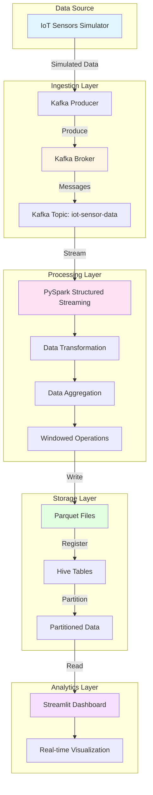

# Architecture Overview

This document provides a detailed overview of the Real-Time Streaming Data Pipeline architecture.

## System Architecture



## Component Details

### 1. Data Source Layer
**IoT Sensors Simulator** (`data_producer/kafka_producer.py`)
- Simulates real-time IoT sensor data
- Generates temperature, humidity, pressure readings
- Produces data to Kafka at configurable intervals
- Supports multiple sensors and locations

**Data Schema:**
```json
{
    "sensor_id": "SENSOR_001",
    "location": "Building_A",
    "timestamp": "2024-01-01T10:00:00",
    "temperature": 23.5,
    "humidity": 65.2,
    "pressure": 1013.25,
    "battery_level": 85.0,
    "status": "ACTIVE"
}
```

### 2. Ingestion Layer
**Apache Kafka**
- **Topic**: `iot-sensor-data`
- **Partitions**: 3 (configurable)
- **Replication Factor**: 1 (for local dev)
- **Retention**: 24 hours
- **Message Format**: JSON

**Configuration:**
- Compression: Snappy
- Acks: All
- Max in-flight requests: 1 (for ordering)

### 3. Processing Layer
**PySpark Structured Streaming** (`spark_streaming/streaming_etl.py`)

**Raw Data Processing:**
- Consumes from Kafka topic
- Parses JSON messages
- Data quality checks
- Adds processing timestamp
- Writes to Parquet with partitioning

**Aggregated Data Processing:**
- 1-minute tumbling windows
- Watermark: 10 minutes
- Aggregations per sensor:
  - Average, Min, Max temperature
  - Average, Min, Max humidity
  - Average pressure
  - Reading count

**Optimizations:**
- Adaptive Query Execution (AQE)
- Dynamic partition coalescing
- Snappy compression
- Checkpointing for fault tolerance

### 4. Storage Layer
**File Format**: Parquet
- Columnar storage format
- Efficient compression (Snappy)
- Schema evolution support
- Predicate pushdown

**Partitioning Strategy:**
```
output/
├── raw_data/
│   ├── date=2024-01-01/
│   │   ├── hour=10/
│   │   │   └── part-00000.parquet
│   │   └── hour=11/
│   │       └── part-00000.parquet
└── aggregated_data/
    └── date=2024-01-01/
        └── hour=10/
            └── part-00000.parquet
```

**Hive Tables:**
- `iot_sensor_raw`: Raw sensor readings
- `iot_sensor_aggregated`: Aggregated metrics

### 5. Analytics Layer
**Streamlit Dashboard** (`dashboard/app.py`)

**Features:**
- Real-time metrics display
- Temperature timeline charts
- Sensor comparison visualizations
- Location-based heatmaps
- Aggregated trends analysis
- Auto-refresh capability
- Interactive data tables

**Visualizations:**
1. Key metrics (active sensors, avg temperature, etc.)
2. Temperature timeline by sensor
3. Sensor performance comparison
4. Temperature by location
5. Aggregated metrics over time
6. Recent sensor readings table

## Data Flow

1. **Data Generation**: IoT simulator generates sensor readings
2. **Ingestion**: Kafka producer sends data to Kafka topic
3. **Stream Processing**: Spark reads from Kafka, transforms, and aggregates
4. **Storage**: Processed data written to Parquet files
5. **Registration**: Hive tables registered over Parquet files
6. **Visualization**: Dashboard reads Parquet files and displays analytics

## Performance Characteristics

### Latency
- End-to-end latency: < 1 minute
- Micro-batch interval: 30 seconds
- Aggregation window: 1 minute

### Throughput
- Producer rate: 1 message/second (configurable)
- Processing capacity: 100+ messages/partition/second
- Scalable to thousands of sensors

### Reliability
- Kafka durability: All replicas acknowledge
- Checkpointing: Every micro-batch
- Watermarking: 10-minute late data tolerance
- Graceful shutdown support

## Scalability Considerations

### Horizontal Scaling
1. **Kafka**: Increase partitions for higher throughput
2. **Spark**: Add more executors/workers
3. **Storage**: Use distributed file systems (HDFS, S3)

### Vertical Scaling
1. **Kafka**: Increase broker resources
2. **Spark**: Increase executor memory and cores
3. **Storage**: Use faster disks (SSD)

## Monitoring & Observability

### Metrics to Monitor
1. **Kafka**: Message rate, lag, broker health
2. **Spark**: Processing rate, batch duration, task failures
3. **Storage**: Disk usage, write throughput
4. **Dashboard**: Query performance, refresh rate

### Tools
- Kafka UI: http://localhost:8080
- Spark UI: http://localhost:4040 (when job is running)
- Streamlit: http://localhost:8501

## Deployment Options

### Local Development
- Docker Compose for infrastructure
- Python virtual environment for applications
- Local file system for storage

### Production Deployment
- **Cloud Provider**: AWS
- **Kafka**: Amazon MSK (Managed Streaming for Kafka)
- **Spark**: Amazon EMR (Elastic MapReduce)
- **Storage**: Amazon S3
- **Metastore**: AWS Glue Data Catalog
- **Dashboard**: AWS EC2 or ECS

## Security Considerations

### Data in Transit
- TLS/SSL for Kafka connections
- Encrypted Spark communication

### Data at Rest
- S3 server-side encryption
- Parquet file encryption

### Access Control
- IAM roles for AWS resources
- Kafka ACLs for topic access
- Hive authorization

## Fault Tolerance

### Kafka
- Replication across brokers
- Leader election on failures

### Spark
- Checkpointing for state recovery
- Driver restart on failure
- Task retry on executor failures

### Storage
- S3 durability (99.999999999%)
- HDFS replication factor

## Cost Optimization

### Storage
- Parquet compression (70% reduction)
- Partitioning for efficient queries
- Lifecycle policies for archival

### Compute
- Auto-scaling for Spark clusters
- Spot instances for non-critical workloads
- Right-sizing executors

### Networking
- VPC endpoints for S3 access
- Data transfer optimization
